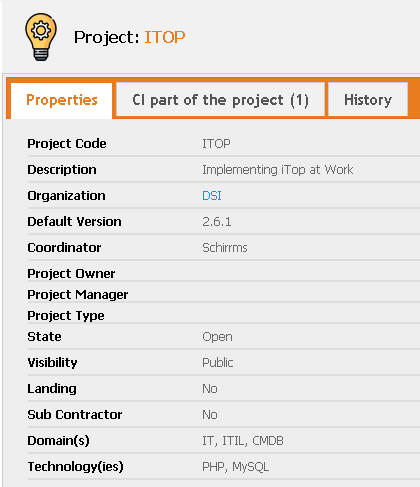
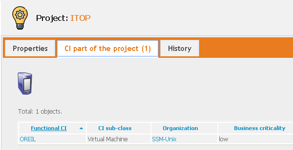

# iTop-Project-Class
Most of our asset are linked to a project (wich is a very conceptual class :) This class is amed to store our project references, and to link them with our asset.

# Goal
This class will probably be 'my work centric' :) I'm not really sure that the terminology can be seen as generic. Anyway, if it can give ideas to others...

Just to let you see, here are all the fields that we use internally to define a project :

Of course, you can see all CIs involved in that project :

# Warning
To be of real use, I think that this project should be added to much more (if not all) kind of CIs. It's very easy, but not done yet.

# Installation
As for all my extensions, just download the zip file, and copy the 'schirrms-...' directory in your extensions directory, then rerun the setup as usual.

# History

0.1.3	2020-01-11	Add the project field in Middleware and Web server/instances and Project to the menu

0.2.0	2020-11-03	Adds a 'Members' panel to link Contacts to the project